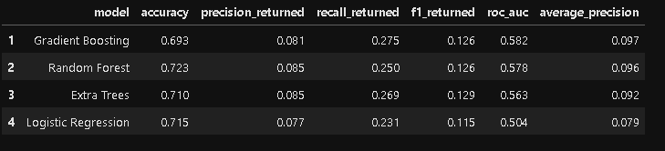
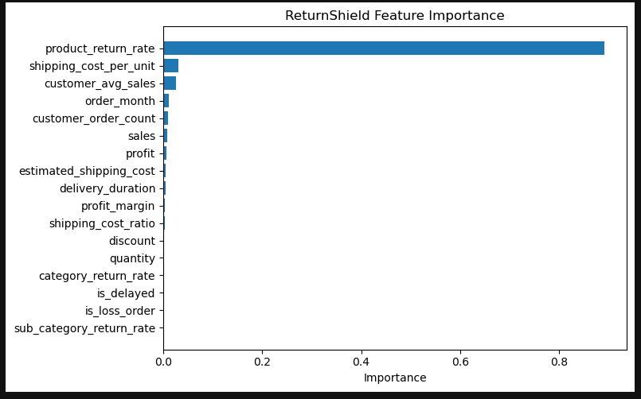
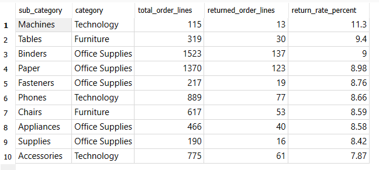
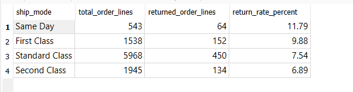
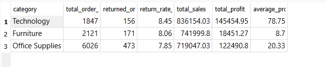
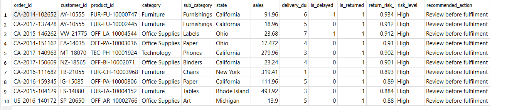
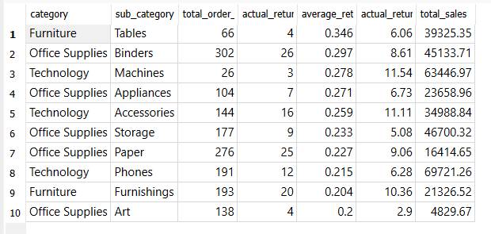

# ReturnShield: Returns Risk Prediction System

**ReturnShield** is an end-to-end retail return-risk analysis project that uses **Python, machine learning, SQLite, and SQL business analysis** to understand product return behaviour and generate return-risk scores at the order-line level.

This project was built to demonstrate a realistic data science workflow: starting from raw retail datasets, cleaning and merging data, engineering business-focused features, comparing machine learning models, generating risk scores, exporting outputs to SQLite, and using SQL to extract business insights.

The main goal is **not to claim a perfect prediction model**, but to show how data science and SQL can be combined to support return-risk monitoring and business decision-making.

---

## Executive Summary

| Area | Summary |
|---|---|
| Project type | End-to-end data science and SQL business analysis project |
| Business focus | Retail/eCommerce returns risk |
| Prediction level | Order-line level |
| Data sources | Orders, returns, and shipping cost data |
| Best model | Gradient Boosting |
| Overall return rate | 8% |
| Best ROC-AUC | 0.582 |
| Strongest model feature | Product-level historical return rate |
| Main value | Clean pipeline, model comparison, risk scoring, SQLite export, and SQL-based business insights |

---

## Project Highlights

- Cleaned and merged **three retail datasets**: orders, returns, and shipping cost data.
- Built an **order-line level return-risk prediction pipeline**.
- Created customer, product, delivery, profitability, and historical return-rate features.
- Compared multiple machine learning models: **Logistic Regression, Random Forest, Extra Trees, and Gradient Boosting**.
- Selected **Gradient Boosting** as the final model based on ROC-AUC performance.
- Generated model-based return-risk scores and business action labels.
- Exported final outputs into a SQLite database.
- Used SQL to analyse return behaviour, operational patterns, model outputs, and commercial impact.
- Explained model limitations clearly instead of overclaiming accuracy.

---

## Business Problem

Product returns are a major challenge for retail and eCommerce businesses because they can affect:

- operational workload
- shipping and fulfilment costs
- refund and reverse-logistics processes
- customer experience
- product quality monitoring
- category and inventory planning

The purpose of this project is to explore whether available order, product, customer, shipping, and profitability data can help identify return-risk patterns.

This project answers questions such as:

- Which product sub-categories have higher return rates?
- Are some shipping modes associated with higher returns?
- Which categories combine return risk with high commercial value?
- Which features influence return-risk scoring?
- Can model-generated risk scores support business monitoring?
- What are the limitations of return prediction when important return-specific data is missing?

---

## Dataset Overview

The project uses three datasets:

| Dataset | Description |
|---|---|
| `Orders.csv` | Order-line level retail transaction data |
| `Return.csv` | Returned order information |
| `Shipping Cost.csv` | State-level shipping cost data |

After merging the datasets, the final dataset contains:

| Metric | Value |
|---|---:|
| Total order lines | 9,994 |
| Returned order lines | 800 |
| Overall return rate | 8% |

Each row represents an **order line**, not a complete customer order. Therefore, this project predicts return risk at the **order-line level**.

This is important because one order may contain multiple product lines, and return behaviour may differ across products within the same order.

---

## Tools and Technologies

| Area | Tools |
|---|---|
| Programming | Python |
| Data processing | Pandas, NumPy |
| Visualisation | Matplotlib |
| Machine learning | Scikit-learn |
| Database | SQLite |
| SQL tool | SQLite Studio |
| Development environment | Jupyter Notebook |

---

## Project Workflow

```text
Raw datasets
    ↓
Data cleaning and column standardisation
    ↓
Dataset merging and validation
    ↓
Return target creation
    ↓
Feature engineering
    ↓
Train-test split
    ↓
Historical return-rate feature creation
    ↓
Model comparison
    ↓
Best model selection
    ↓
Risk score generation
    ↓
SQLite database export
    ↓
SQL business analysis
```

---

## Data Preparation

The data preparation stage included:

- loading all three datasets
- standardising column names
- merging orders with returns using `order_id`
- merging shipping costs using `state`
- validating row counts after merging
- checking key missing values
- creating the binary return target `is_returned`
- converting date columns into readable date format
- creating an estimated shipping cost feature

The merge was validated to ensure the number of rows remained consistent with the original order-line dataset.

---

## Feature Engineering

The project created business-focused features designed to capture customer behaviour, product behaviour, delivery patterns, profitability, and historical return behaviour.

| Feature | Purpose |
|---|---|
| `shipping_cost_ratio` | Measures shipping cost relative to sales value |
| `is_delayed` | Flags order lines with longer delivery duration |
| `customer_order_count` | Captures customer purchase frequency |
| `customer_avg_sales` | Captures average customer sales value |
| `order_month` | Captures month-level order timing |
| `profit_margin` | Measures profitability relative to sales |
| `is_loss_order` | Flags order lines with negative profit |
| `product_return_rate` | Captures historical product-level return behaviour |
| `category_return_rate` | Captures historical category-level return behaviour |
| `sub_category_return_rate` | Captures historical sub-category return behaviour |
| `state_return_rate` | Captures historical state-level return behaviour |
| `segment_return_rate` | Captures historical customer segment return behaviour |
| `ship_mode_return_rate` | Captures historical shipping-mode return behaviour |

### Data Leakage Control

Historical return-rate features were created **after the train-test split using training data only**. This was done to avoid using information from the test set during feature creation.

This makes the modelling workflow more realistic and prevents the model from learning future information.

---

## Model Comparison

Four machine learning models were trained and compared:

- Logistic Regression
- Random Forest
- Extra Trees
- Gradient Boosting

Gradient Boosting achieved the best ROC-AUC score among the tested models and was selected as the final model.



### Why ROC-AUC Was Used

Accuracy alone is not enough for this project because only **8%** of order lines were returned. In imbalanced datasets, a model can achieve high accuracy by mostly predicting the majority class.

For this reason, the model comparison considered metrics such as:

- precision for returned order lines
- recall for returned order lines
- F1-score for returned order lines
- ROC-AUC
- average precision

---

## Feature Importance

Feature importance analysis showed that **product-level historical return rate** was the strongest predictor of return risk.



This suggests that some products are consistently associated with higher return risk. However, the dominance of `product_return_rate` also shows that the model depends heavily on historical product behaviour.

This is useful as a business insight, but it also highlights the need for richer return-specific data in future improvements.

---

## Risk Score Interpretation

The model generates a `return_risk_score` for each order line in the test set. This score should be interpreted as a **decision-support signal**, not a guaranteed prediction.

A high score means the order line shares patterns with items that were more likely to be returned in the training data. However:

- not every high-risk order line will actually be returned
- not every returned order line will receive a high score
- some false positives are expected
- the model should support review and prioritisation, not automated decision-making

This is especially important because the dataset does not include deeper return-specific information such as return reasons, customer complaints, product damage details, or review text.

---

## SQL Business Analysis

After the Python pipeline generated model outputs, the final datasets were exported into SQLite:

```text
sql/returnshield.db
```

SQL analysis was performed using SQLite Studio. The SQL script is stored in:

```text
sql/returnshield_business_analysis.sql
```

The SQL analysis focused on:

- return behaviour by product sub-category
- return behaviour by shipping mode
- return behaviour by state
- category-level sales, profit, and return patterns
- model-generated risk scores
- sub-category-level risk monitoring

---

## Key Business Insights

### 1. Return patterns are clearer at the sub-category level

Broad product categories had similar return rates, but sub-category analysis showed more useful variation.



Sub-categories such as **Machines, Tables, and Binders** showed higher return rates than the overall dataset return rate of 8%.

This suggests that return-risk monitoring is more useful at the sub-category level than only looking at broad product categories.

---

### 2. Faster shipping modes showed higher return rates

Same Day and First Class shipping modes had higher return rates than Standard Class and Second Class.



This suggests that shipping mode may provide useful operational signals for return-risk analysis. However, this does not prove that faster shipping directly causes returns. It only shows an association in this dataset.

---

### 3. Technology had high commercial importance

Technology showed the highest broad-category return rate and also generated the highest total sales and profit.



This makes Technology an important category to monitor. Even small return-rate changes in high-value categories can have meaningful business impact.

---

### 4. The model assigned high risk scores to some actual returned order lines

The model assigned high return-risk scores to several order lines that were actually returned.



This supports the idea that risk scores can help identify some return-prone order lines. However, the model should be used as a support tool rather than a perfect classifier.

---

### 5. Sub-category risk analysis combines model scores and business context

Sub-category risk analysis combined:

- average model risk score
- actual return rate
- order-line volume
- total sales



This type of analysis can help business teams prioritise product areas for further review, especially when model scores are considered together with actual return rates and commercial value.

---

## Results Summary

| Area | Key Result |
|---|---|
| Overall return rate | 8% |
| Best model | Gradient Boosting |
| Best model ROC-AUC | 0.582 |
| Average precision | 0.097 |
| Strongest feature | Product return rate |
| Strong SQL insight | Sub-category and shipping mode patterns were more informative than broad category analysis |
| Best project value | End-to-end pipeline, risk scoring, SQLite export, and SQL business analysis |

---

## Why the Model Performance Is Moderate

The model performance is moderate rather than highly predictive. This is not treated as a failure of the project. It reflects realistic limitations in the available data.

Main reasons:

1. **Class imbalance**  
   Only 8% of order lines were returned, so the model had fewer returned examples to learn from.

2. **Missing return-specific variables**  
   The dataset does not include return reasons, defect details, complaint history, review text, or customer support interactions.

3. **Limited behavioural context**  
   The data includes order and product information, but does not fully capture why a customer decided to return an item.

4. **Refund impact is not directly captured**  
   The dataset includes sales and profit, but it does not directly show refund costs or post-return financial loss.

5. **Risk scores are not perfect predictions**  
   The model can help prioritise review, but it should not be used as an automated decision system without stronger data and further validation.

Because of these limitations, the project is best understood as an **end-to-end return-risk pipeline and business analysis project**, not a production-ready return prediction system.

---

## Why This Project Is Still Valuable

Even with moderate model performance, this project is valuable because it demonstrates the complete workflow expected in a real data role:

- converting raw datasets into structured analytical tables
- validating merges and target creation
- engineering useful business features
- comparing multiple models instead of relying on one algorithm
- evaluating performance honestly
- generating risk scores for decision support
- exporting data science outputs into SQLite
- using SQL to produce business insights
- explaining limitations and future improvements clearly

This reflects realistic data science work, where model results depend heavily on data quality and available business signals.

---

## Future Improvements

Future improvements could include:

- adding return reason data
- adding customer complaint or support ticket history
- including product review text
- adding product ratings
- tracking customer return behaviour over time
- incorporating refund cost and reverse-logistics cost
- tuning classification thresholds
- testing advanced models such as XGBoost or LightGBM
- building an interactive dashboard
- deploying the scoring workflow as an automated pipeline

---

## Project Structure

```text
ReturnShield/
├── data/
│   ├── Orders.csv
│   ├── Return.csv
│   └── Shipping Cost.csv
│
├── notebooks/
│   └── ReturnShield_Project.ipynb
│
├── outputs/
│   ├── screenshots/
│   ├── returnshield_cleaned_dataset.csv
│   ├── returnshield_risk_scores.csv
│   ├── returnshield_model_comparison.csv
│   ├── returnshield_feature_importance.csv
│   ├── returnshield_confusion_matrix.csv
│   ├── returnshield_model_metrics.csv
│   └── returnshield_feature_importance_plot.png
│
├── sql/
│   ├── returnshield.db
│   └── returnshield_business_analysis.sql
│
├── README.md
├── requirements.txt
└── .gitignore
```

---

## How to Run This Project

1. Clone or download this repository.

2. Install the required Python libraries:

```bash
pip install -r requirements.txt
```

3. Open the Jupyter Notebook:

```text
notebooks/ReturnShield_Project.ipynb
```

4. Run all notebook cells from top to bottom.

5. Open the SQLite database in SQLite Studio:

```text
sql/returnshield.db
```

6. Run the SQL queries from:

```text
sql/returnshield_business_analysis.sql
```

---


## Final Summary

ReturnShield demonstrates a complete data science workflow from raw retail data to business insight.

The project combines:

- data cleaning
- multi-table merging
- feature engineering
- model comparison
- risk score generation
- SQLite database export
- SQL business analysis
- honest model interpretation

Although the model performance is moderate, the project shows how machine learning and SQL can work together to support return-risk monitoring and business decision-making.
